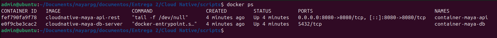
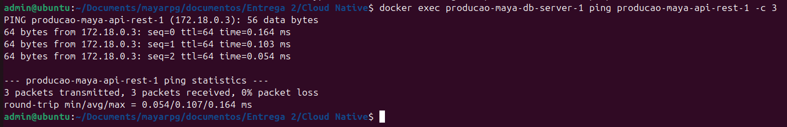
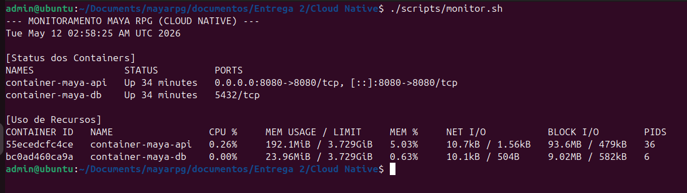
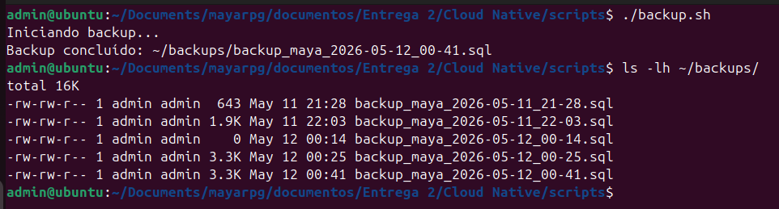
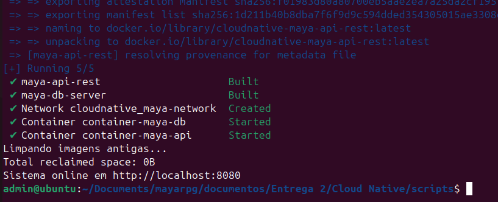
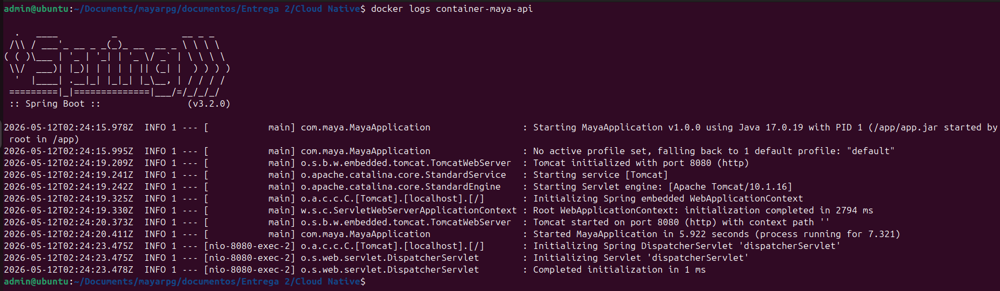
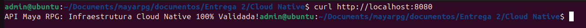

# Relatório de Validação Técnica — Cloud Native

> **Projeto:** Maya Fisioterapia/RPG — Backend & Infraestrutura
>
> **Aluno responsável:** Luiz Felipe da Silva Lima
>
>**Escopo:** Automação Linux e Containerização
>
> **Validação técnica:** 11/05/2026 em ambiente Linux Ubuntu Server (Docker v26.x / Compose v2.x)
>
> **Evidências visuais:** [`Imagens/cloud-native/`](../../../Imagens/cloud-native/)

Este documento detalha os testes realizados para validar a resiliência, persistência e automação da infraestrutura do Projeto Maya.

---

##  Orquestração e Saúde dos Serviços
**Objetivo:** Validar se o Docker Compose gerencia corretamente o ciclo de vida da API e do Banco de Dados.

* **Comando:** `docker ps`
* **Evidência:**

---

## Conectividade de Rede (Interoperabilidade)
**Objetivo:** Provar que a rede isolada `maya-network` permite a comunicação segura via DNS interno entre a aplicação e o banco.

* **Comando:** `docker exec container-maya-db ping container-maya-api -c 3`
* **Resultado esperado:** 0% de perda de pacotes.
* **Evidência:**

---

## Persistência de Dados (Confiabilidade)
**Objetivo:** Validar se as informações clínicas dos pacientes sobrevivem a falhas ou reinicializações do servidor através de Volumes Persistentes.

* **Teste realizado:** Criação de tabela `valida_entrega`, execução de `docker compose down` e posterior consulta após novo deploy.

* **Comando:** `SELECT * FROM valida_entrega;`
* **Resultado:** O dado `INFRA_OK` foi retornado com sucesso após o restart.
* **Evidência:**

---

## Automação e Monitoramento
**Objetivo:** Demonstrar o uso de Shell Scripting para automação de tarefas de administração de sistemas (SysAdmin).

### 1. Backup Estruturado
* **Comando:** `./backup.sh`
* **Evidência:** Print do comando executado e do arquivo `.sql` gerado na pasta `~/backups`.

### 2. Monitoramento de Recursos
* **Comando:** `./monitor.sh`
* **Evidência:** Print da tabela de consumo de CPU/RAM em tempo real.

---

## 5. Validação de Runtime da API (Sucesso de Integração)

**Objetivo:** Provar que a API é um serviço funcional e não apenas um container vazio.

### Passo 1: Logs de Inicialização

* **Comando:** `docker logs container-maya-api`
* **Resultado:** Sucesso no bootstrap do Spring Boot e ativação da JVM na porta 8080.
* **Evidência:**

### Passo 2: Resposta do Endpoint (Curl)

* **Comando:** `curl http://localhost:8080`
* **Resultado:** Resposta direta da aplicação confirmando a validação da infraestrutura.
* **Evidência:**

---

## Mapeamento ISO/IEC 25010

| Característica | Implementação Prática |
|:---:|:---|
| **Confiabilidade** | Persistência via Volumes Docker e Recuperabilidade via Backup automático. |
| **Portabilidade** | Ambiente 100% containerizado com Dockerfile multi-stage. |
| **Eficiência** | Monitoramento ativo de hardware via scripts Bash. |
| **Operabilidade** | Deploy automatizado via script, reduzindo erro humano. |

---
